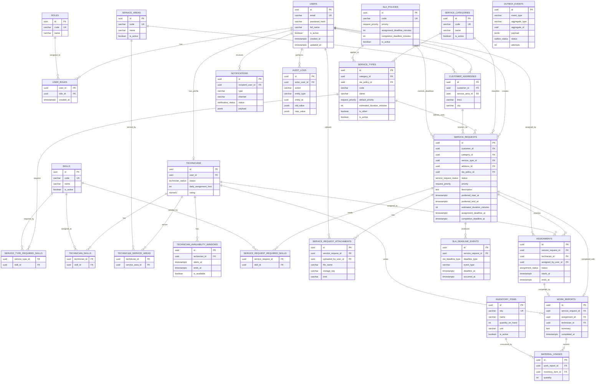

# Entity Relationship Diagram

## 1. Purpose

This document shows the main database relationships as an ER diagram.

Use it together with:

```text
docs/design/DATABASE_SCHEMA.md
```

The diagram is intentionally focused on MVP backend relationships. It does not show every column, only the fields needed to understand ownership, foreign keys, and cardinality.

## 2. Relationship Legend

Mermaid cardinality notation:

```text
||--|| one-to-one
||--o{ one-to-many
}o--o{ many-to-many
```

In SQL, many-to-many relationships are implemented through explicit join tables.

Examples:

```text
users ||--o{ service_requests
one user can create many service requests

technicians ||--o{ technician_skills
one technician can have many skill links

skills ||--o{ technician_skills
one skill can be linked to many technicians
```

## 3. MVP ER Diagram



## 4. Important Modeling Notes

### Users and Technicians

`technicians` is a profile table over `users`.

This means:

```text
one user can have zero or one technician profile
one technician profile belongs to exactly one user
```

Not every user is a technician. Customers, dispatchers, and admins are regular users with roles.

### Skills

Skills are used in two places:

```text
service_types define default required skills
service_requests store copied or triaged required skills
technicians store possessed skills
```

This is deliberate. A request keeps a snapshot of required skills so later catalog edits do not silently change existing requests.

### Service Areas

Customer addresses belong to a service area.

Technicians serve many service areas through `technician_service_areas`.

Assignment checks compare:

```text
request address service_area_id
technician_service_areas.service_area_id
```

### Assignments

A service request can have many assignment rows historically, but only active assignments should block technician time.

Active statuses:

```text
assigned
accepted
on_the_way
in_progress
```

Cancelled or completed assignments should not block future scheduling.

### Work Reports and Materials

Each completed service request should have one work report.

A work report can contain many material usages.

Inventory is decremented in the same transaction as completion.

### Outbox

`outbox_events` is intentionally not linked by foreign key to every aggregate table because it stores events for multiple aggregate types.

It uses:

```text
aggregate_type
aggregate_id
```

This is a common tradeoff for generic event storage.
